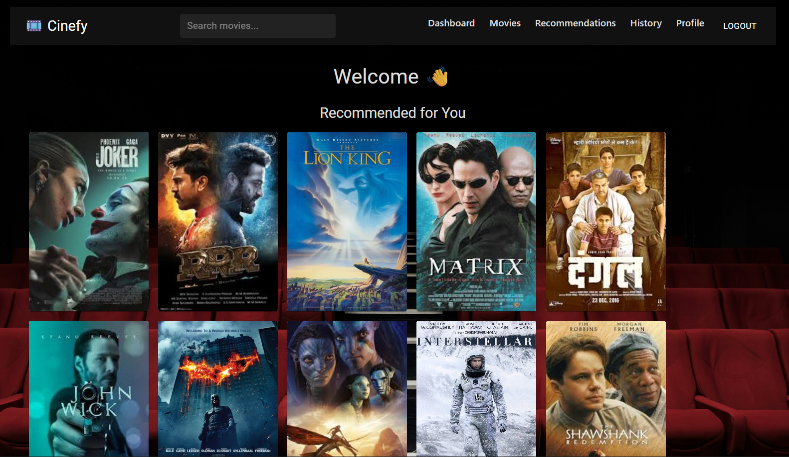
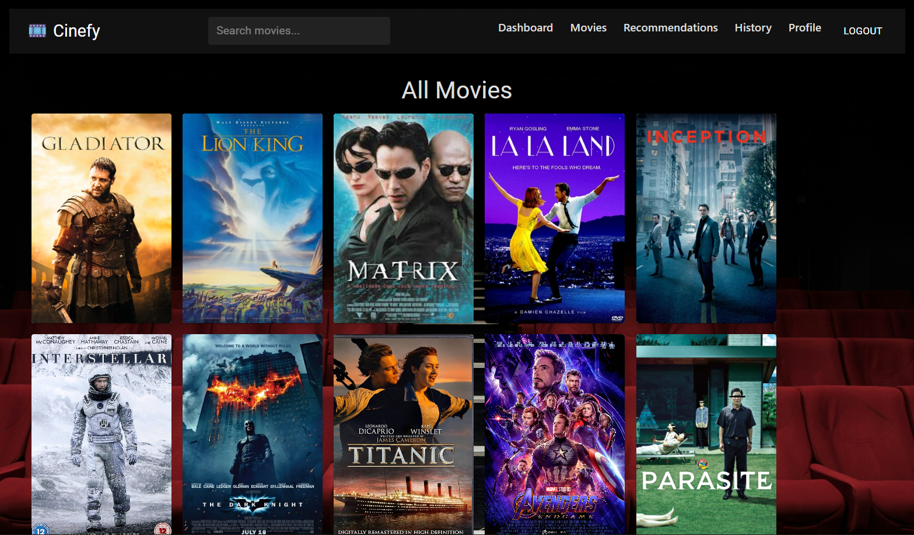
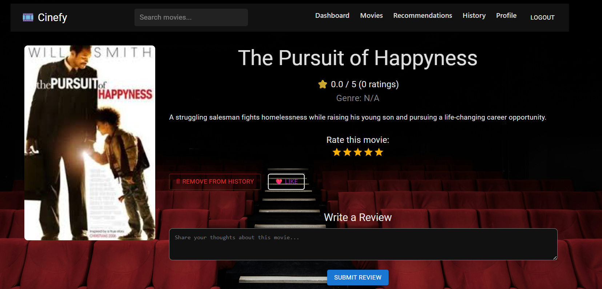
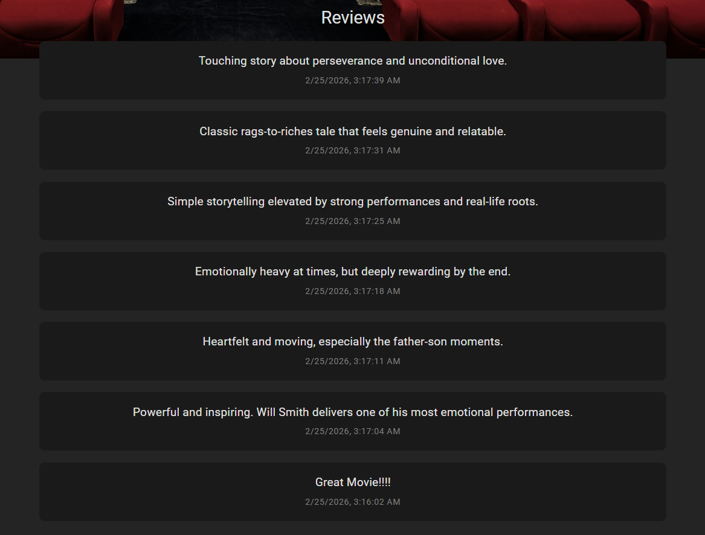
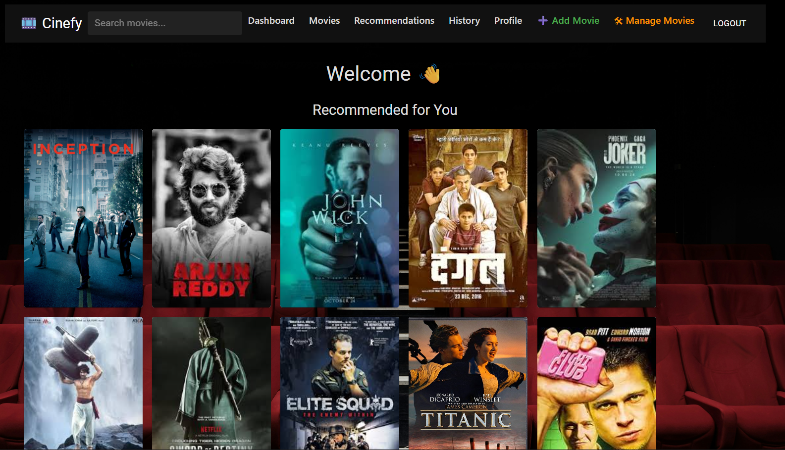
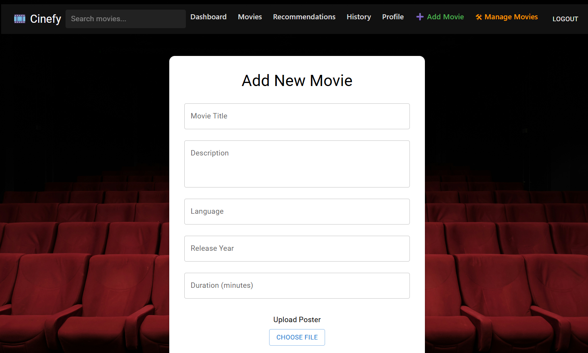
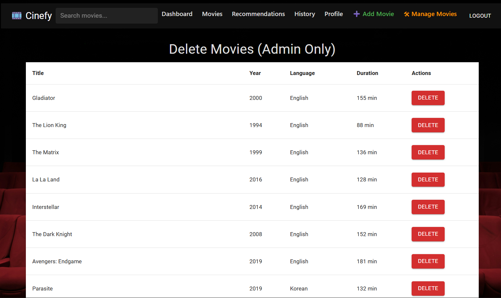

# 🎬 Cinefy — Full-Stack Movie Recommendation Platform

Cinefy is a production-grade, full-stack movie recommendation system built using:

- ⚛️ React (Frontend)
- ⚡ Vite
- 🎨 Material UI
- ☕ Spring Boot (Backend)
- 🐘 PostgreSQL
- 🔐 JWT Authentication
- 📊 Real-Time Analytics Engine

This repository combines:

- Frontend implementation
- Backend API
- Database schema
- Analytics engine
- Recommendation system
- Screenshots
- Architecture documentation

---

# 🚀 Live Overview

Cinefy allows users to:

- Browse movies
- View detailed metadata
- Like & watch movies
- Rate & review
- Get personalized recommendations
- See trending movies powered by analytics

---

# 🏗 System Architecture

## High-Level Architecture

```
                 ┌─────────────────────────────┐
                 │        React Frontend       │
                 │  (Vite + Material UI)       │
                 └──────────────┬──────────────┘
                                │ REST API
                                ▼
                 ┌─────────────────────────────┐
                 │       Spring Boot API       │
                 │ Auth • Movies • Analytics   │
                 └──────────────┬──────────────┘
                    ┌───────────┴───────────┐
                    ▼                       ▼
        ┌──────────────────────┐  ┌──────────────────────┐
        │ PostgreSQL Database  │  │ File Storage (Local) │
        │ Users • Movies •     │  │ Posters / Uploads    │
        │ Stats • Ratings      │  └──────────────────────┘
        └──────────────────────┘
```

---

# 🧠 Recommendation & Analytics Engine

Trending score is computed daily using:

```
score =
  views_count * 2 +
  watch_count * 3 +
  likes_count * 4 +
  ratings_count * 2 +
  reviews_count * 3
```

Daily analytics stored in:

```
movie_daily_stats
```

Enables:

- Engagement-based ranking
- Real-time trending
- Future ML extensibility

---

# 🖼 Screenshots

## 🏠 Dashboard



---

## 🎥 Movie Details




---

## ⭐ Reviews & Ratings



---

## ❤️ Watch History


---

## 🛠 Admin Panel







---

# 🧱 Monorepo Structure

```
cinefy-app/
│
├── cinefy-frontend/     # React Frontend
├── cinefy-backend/      # Spring Boot Backend
├── screenshots/         # UI Screenshots
├── docs/                # Architecture & Diagrams
└── README.md
```

---

# 🔐 Authentication Flow

1. User logs in
2. Backend generates JWT
3. Token stored in browser
4. Protected routes require token
5. Expired token triggers logout

Stateless authentication.

---

# 📊 Database Schema (Simplified)

```
users
movies
genres
movie_genres
user_movie_ratings
movie_reviews
movie_daily_stats
```

Referential integrity enforced via foreign keys.

---

# ⚙️ How to Run Locally

## 1️⃣ Clone repository

```
git clone https://github.com/siri-chandanak/cinefy-app.git
cd cinefy-app
```

---

## 2️⃣ Run Backend

```
cd cinefy-backend
./mvnw spring-boot:run
```

Backend runs on:

```
http://localhost:8080
```

---

## 3️⃣ Run Frontend

```
cd cinefy-frontend
npm install
npm run dev
```

Frontend runs on:

```
http://localhost:5173
```

---

# 🚢 Deployment Strategy

## Frontend

- Vercel
- Netlify
- Nginx static hosting

## Backend

- Docker container
- AWS ECS
- GCP Cloud Run
- Kubernetes cluster

---

# 📈 Production-Ready Features

✔ Clean layered architecture  
✔ JWT security  
✔ Engagement analytics  
✔ Trending engine  
✔ Admin movie management  
✔ Image upload support  
✔ Dynamic genre loading  
✔ Stateless REST design  

---

# 🧠 Future Improvements

- Collaborative filtering
- AI-based recommendation engine
- Redis caching
- ElasticSearch integration
- CI/CD automation
- Cloud-native deployment

---

# 📜 License

MIT License

---

# 👩‍💻 Author

Cinefy designed and built by **Siri Chandana**

Full-stack implementation demonstrating:

- Backend engineering
- Secure API design
- Analytics architecture
- Frontend system design
- Production mindset
